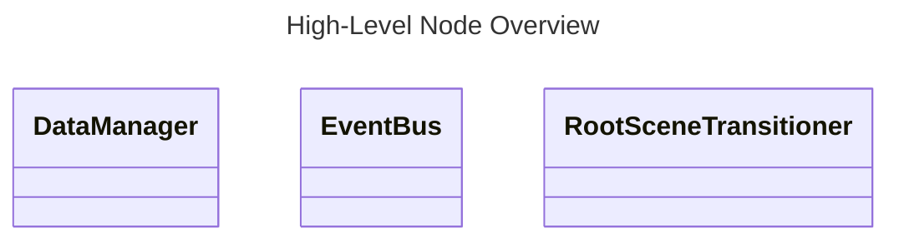
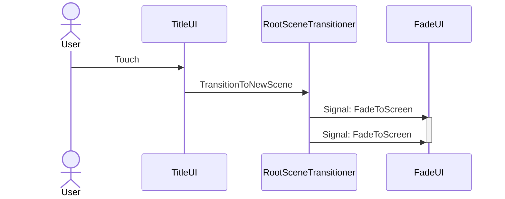

## High-Level Node Overview

```mermaid
---
title: High-Level Node Overview
---
classDiagram
%% NOTE: Autoloads
	%% On program startup, DataManager checks for saves and loads. It's an autoload, so it's _ready() runs first
	class DataManager
	%% Holds all signals for objects to use broadcast pattern
	class EventBus
	%% Responsible for loading & switching between different root scenes. A "helper" class
	class RootSceneTransitioner
```

---

```mermaid
sequenceDiagram
		actor User
		User->>TitleUI: Touch
		TitleUI->>RootSceneTransitioner: TransitionToNewScene
		RootSceneTransitioner->>FadeUI: Signal: FadeToScreen
		activate FadeUI
		RootSceneTransitioner->>FadeUI: Signal: FadeToScreen
		deactivate FadeUI

```
